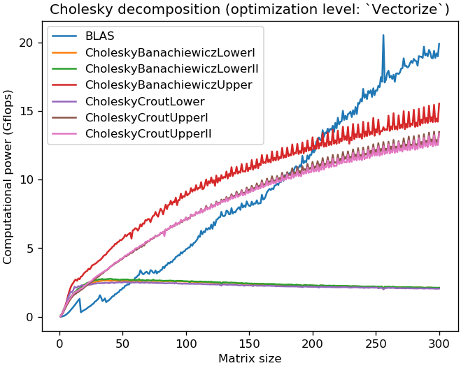

# Conditionally optimize Julia code

[](./LICENSE.md)
[](https://github.com/emmt/MayOptimze.jl/actions/workflows/CI.yml?query=branch%3Amaster)
[](https://ci.appveyor.com/project/emmt/MayOptimize-jl/branch/master)
[](https://coveralls.io/github/emmt/MayOptimize.jl?branch=master)


When writing high performance [Julia][julia-url] code, you may want to keep a
reference code that perform bound checking, another version that assumes valid
indices (and thus avoid bound checking) and perhaps a more heavily optimized
version that requires loop vectorization.  The [MayOptimize][repository-url]
package let you have the 3 variants available with a *single* version of the
code.


## Documentation

The usage of [MayOptimize][repository-url] is summarized in the following short
example:

```julia
using MayOptimize

function foo!(::Type{P}, x::AbstractArray{T}) where {T<:Real, P<:OptimLevel}
    s = zero(T)
    # Loop 1: compute the sum of values.
    @maybe_inbounds P for i in eachindex(x)
        s += x[i]
    end
    # Loop 2: fill with sum of values.
    @maybe_vectorized P for i in eachindex(x)
        x[i] += s
    end
    return x, s
end
```

Note that the two above loops are preceded by the macros `@maybe_inbounds` and
`@maybe_vectorized` which both take 2 arguments: a parameter `P` and an
expression or a block of code (the 2nd argument must be a simple `for` loop for
the `@maybe_vectorized` macro).

How is compiled the expression or the block of code is determined by the
type parameter `P`:

- `P <: Debug` for debugging or reference code that performs bound checking and
  no vectorization.

- `P <: InBounds` for code that assumes valid indices and thus avoids bound
  checking.

- `P <: Vectorize` for code that assumes valid indices and requires
  vectorization.

A block of code provided to the `@maybe_inbounds` macro will be compiled with
bound checking (and thus no vectorization) if `P <: Debug` and without bound
checking (as if `@inbounds` was specified) if `P <: InBounds`.  Since
`Vectorize <: InBounds`, specifying `Vectorize` in `@maybe_inbounds` also avoid
bound checking.

A block of code provided to the `@maybe_vectorized` macro will be compiled with
bound checking and no vectorization if `P <: Debug`, with no bound checking if
`P <: InBounds` (as if `@inbounds` was specified) and with no bound checking
and vectorization if `P <: Vectorize` (as if both `@inbounds` and `@simd` were
specified).

Hence which version of `foo!` is called is decided by Julia method dispatcher
according to the abstract types `Debug`, `InBounds` or `Vectorize` exported by
`MayOptimize`.  Calling:

```julia
foo!(Debug, x)
```

executes a version that checks bounds and does no vectorization, while calling:

```julia
foo!(InBounds, x)
```

executes a version that avoids bound checking (in the 2 loops) and finally
calling:

```julia
foo!(Vectorize, x)
```
executes a version that avoids bound checking (in the 2 loops) and vectorizes
the second loop.

It is easy to provide a default version so that other users need not have to
bother choosing which version to use.  For instance, assuming that you have
checked that your code has no issues with indexing but that vectorization makes
almost no difference, you may write:

```julia
foo!(x::AbstractArray{T}) where {T<:Real} = foo!(InBounds, x)
```

and decide later to change the default optimization level.


## Installation

In Julia, hit the `]` key to switch to the package manager REPL (you should get
a `... pkg>` prompt) and type:

```julia
add MayOptimize
```

No other packages are needed.


## Examples

### Left divison by a triangular matrix

`MayOptimize` extends a few base linear algebra methods such as the `ldiv!`
method to perform the left division of a vector `b` by a matrix `A` and can be
called as:

```julia
using MayOptimize, LinearAlgebra
ldiv!(opt, A, b)
ldiv!(opt, y, A, b)
```

In the first case, the operation is done in-place and `b` is overwritten with
`A\b`, in the second case, `A\b` is stored in `y`.  Argument `opt` can be
`MayOptimize.Standard` to use Julia standard method (probably BLAS), `Debug`,
`InBounds`, or `Vectorize` to compile Julia code in `MayOptimize` with
different optimization settings.  The following figures (obtained with Julia
1.6.3 on an AMD Ryzen Threadripper 2950X 16-Core processor) show how efficient
can be Julia code when compiled with well chosen optimization settings (note
the 1.7 gain compared to the standard implementation when `@simd` is used in
the innermost loop level).  Having a look at [`src/linalg.jl`](src/linalg.jl),
you can realize that the code is identical for the `Debug`, `InBounds` or
`Vectorize` settings (only the `opt` argument changes) and that this code turns
out to be pretty straightforward.


### Cholesky decomposition

`MayOptimize` also extends the `cholesky` and `cholesky!` methods to perform
the Cholesky decomposition (without pivoting) of an Hermitian matrix `A` by
regular Julia code and with optimization level `opt`:

```julia
using MayOptimize, LinearAlgebra
cholesky!(opt, A)
B = cholesky(opt, A)
```

In the first case, the decomposition is done in-place and the uopper or lower
triangular part of `A` is overwritten with one factor of its Cholesky
decomposition which is returned.  In the second case, `A` is left unchanged.
Apart from the `opt` argument (which also avoids *type-piracy*) and rounding
errors, the result is the same as with the standard method provided by
`LinearAlgebra` and which calls BLAS.  As illustrated below, the Julia code may
be much faster than BLAS for matrices of size smaller or equal 200×200 in spite
of the fact that BLAS may run on several threads whereas the optimized Julia
code is executed on a single thread.

The `opt` argument specifies the optimization level (`Debug`, `InBounds`, or
`Vectorize`) and/or the algorithm used for the decomposition
(`CholeskyBanachiewiczLowerI`, `CholeskyBanachiewiczLowerII`,
`CholeskyBanachiewiczUpper`, `CholeskyCroutLower`, `CholeskyCroutUpperI`, or
`CholeskyCroutUpperII`).  For instance, choose `op` to be
`CholeskyBanachiewiczLower(Vectorize)` to compute the `L'⋅L` Cholesky
factorization with `L` lower triangular by the Cholesky-Banachiewicz (row-size)
algorithm with loop vectorization.  If only an algorithm is specified without
optimization level, the best optimization level for this algorithm is used.
Conversely, if only the optimization level is specified, the fastest algorithm
is used.  However these default choices are optimal for a testing machine
which may be different than yours.

The following figures (obtained with Julia 1.6.3 with `Float32` values on an
AMD Ryzen Threadripper 2950X 16-Core processor) show how efficient can be Julia
code when compiled with well chosen optimization settings (note the 200% gain
compared to the BLAS implementation when `@simd` is used in the innermost loop
levels for 100×100 matrices).





[repository-url]:  https://github.com/emmt/MayOptimize.jl

[julia-url]: https://julialang.org/
[julia-pkgs-url]: https://pkg.julialang.org/
